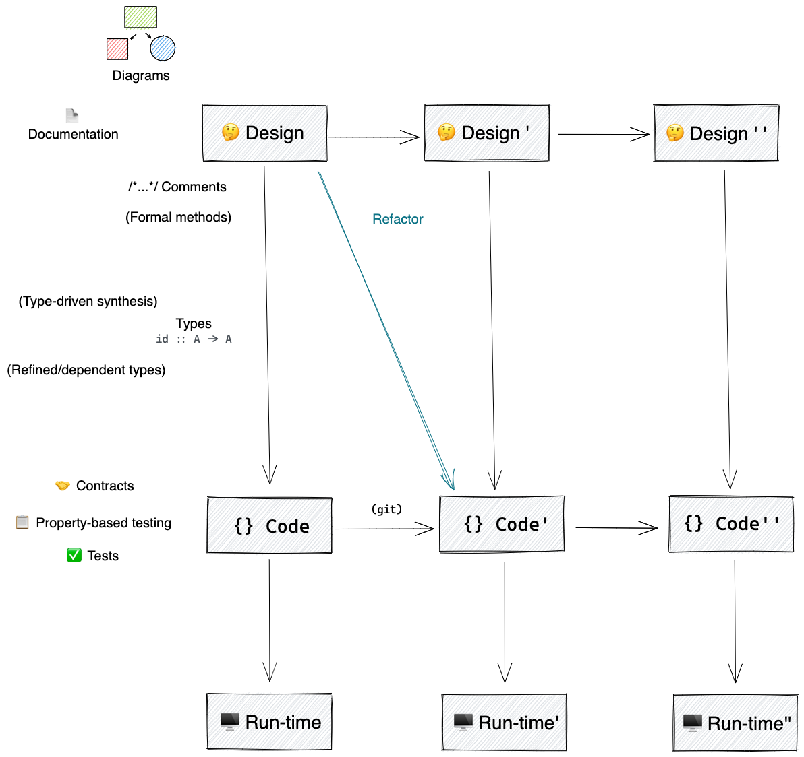

# Functional programming with Typescript

## What properties do we want our software to have?

- _Correctness_:
  The software does what it's supposed to do, i.e., reflects its _design_
- _Flexibility_:
  The software is easy to modify as the design (requirements) change

## Why functional programming

- Make design explicit with types
- Compositionality

We can think of our software as derived from a design.
There's several ways to check if our code matches our design, ordered in the
image depending on how close they are to the design or code levels.

<small>See <a href="http://www.pathsensitive.com/2018/01/the-three-levels-of-software-why-code.html">3 levels of software</a></small>

## Course contents

1. [Explicit design with types](./presentation-english-markdown/1types-explicit-design.md)
2. [Compositionality](./presentation-english-markdown/2compositionality.md)
3. [Brief history of JS and TS](./presentation-english-markdown/3brief-history.md)
4. [Basic JS and TS types](./presentation-english-markdown/1types-explicit-design.md)
5. [Functions](./presentation-english-markdown/5functions.md)
6. [Immutability](./presentation-english-markdown/6immutability.md)
7. [Implementing map, filter, reduce](./presentation-english-markdown/7map-filter-reduce.md)
8. [Currying](./presentation-english-markdown/8currying.md)
9. [Compose](./presentation-english-markdown/9compose.md)
10. [Pipe and flow examples](./presentation-english-markdown/10fp-ts-pipe.ts)
11. [Combinators](./presentation-english-markdown/11combinators.md)
12. [Exercises](./presentation-english-markdown/12.1exercises.ts)
13. [Recursion](./presentation-english-markdown/13recursion.md)
14. [TS type system: structural vs nominal, soundness vs completeness, variance](./presentation-english-markdown/14structural-soundness-variance.md)
15. [Sum and product types](./presentation-english-markdown/15sum-product-types.md)
16. [Nominal types and smart constructors](./presentation-english-markdown/16nominal-smart-constructors.md)
17. [Advanced TS types](./presentation-english-markdown/17advanced-types.ts)
18. [Contracts](./presentation-english-markdown/18contracts.md)
19. [Property-based testing](./presentation-english-markdown/19property-based-testing.md)
20. [ADTs - Maybe](./presentation-english-markdown/20adts.md)
