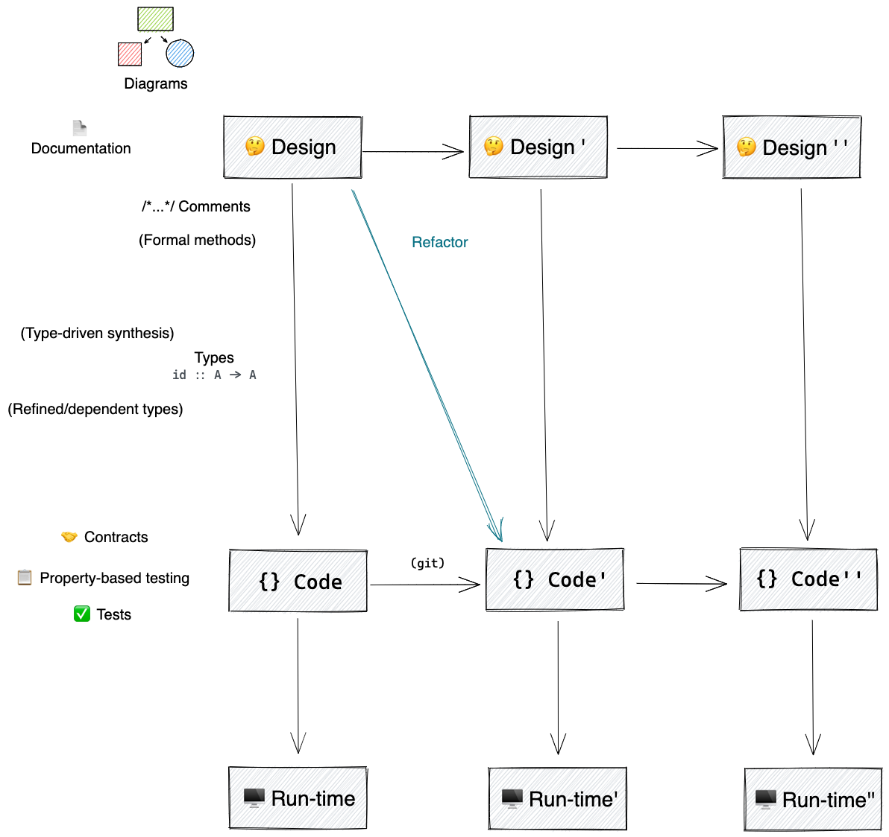

# Functional programming with Typescript

## Why functional programming

### What properties do we want our software to have?

- Correctness
  The software does what it's supposed to do, i.e., reflects its _design_
- Flexibility
  The software is easy to modify as the design (requirements) change

### So why functional programming

- Make design explicit with types
- Compositionality

## Course contents

### Resources

[3 levels of software](http://www.pathsensitive.com/2018/01/the-three-levels-of-software-why-code.html)

[Design of software](http://www.pathsensitive.com/2018/01/the-design-of-software-is-thing-apart.html)
