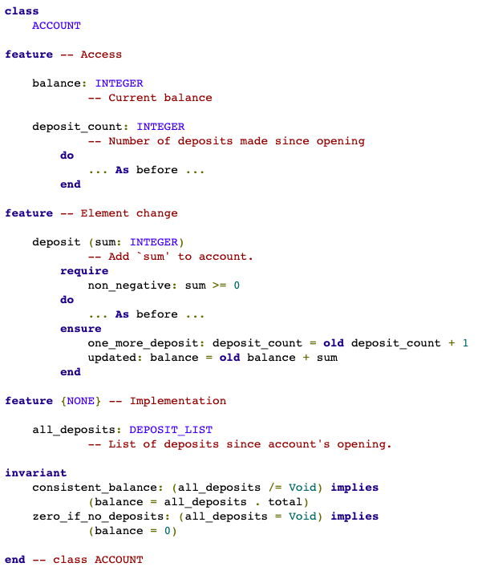

# Contracts

Contracts are runtime assertions that check if code meets our design invariants.
Some languages, like Eiffel, have them baked in.



```ts
const assert = require('assert').strict

export const divide = (num: number, den: number): number => {
  assert(den !== 0, 'Should be non-zero')
  const result = num / den
  assert(num > den ? result < den : result > den, 'division should work')
  return result
}

divide(1, 0) //-> throws exception
```

What contract could we have for the following code?

```ts
const getUniqueArrayByProp = <A, K extends keyof A>(prop: K) => (
  as: A[],
): A[] => as.filter((a, i) => as.findIndex(a_ => a[prop] === a_[prop]) === i)
```

The Zod library lets us define validators and extract types from them

```ts
import * as z from 'zod'

const myStr = z.string().refine((x: string) => !x.includes('a'))
type MyStr = z.infer<typeof myStr> // string

const x: MyStr = 12 //❌ TypeError
const y: MyStr = 'asdf' //✅

z.function(z.tuple([z.string()]), z.string()).implement(x => x + '!')
```
