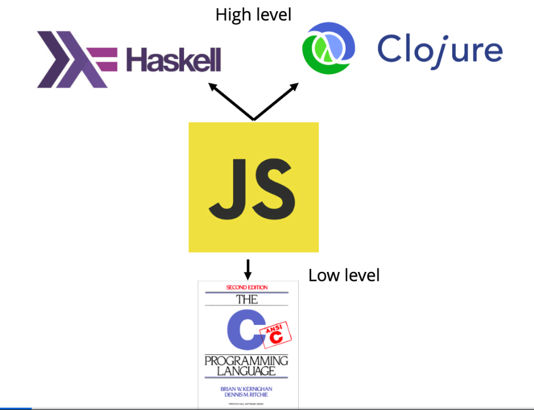
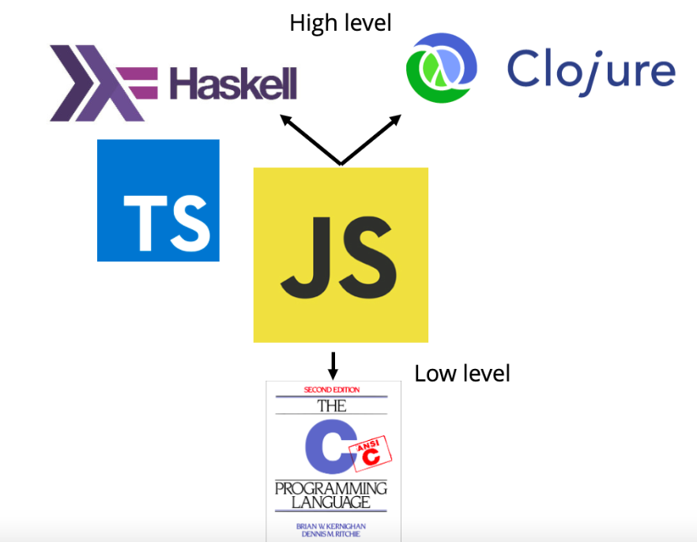

# Brief history of JS and TS

(WIP)

JS creator Brendan Eich was hired to "put Scheme in the browser" (but see [this](https://journal.stuffwithstuff.com/2013/07/18/javascript-isnt-scheme/)), but with a Java-like syntax.
TS, on the other hand, brings us closer to the ML branch of functional programming.

