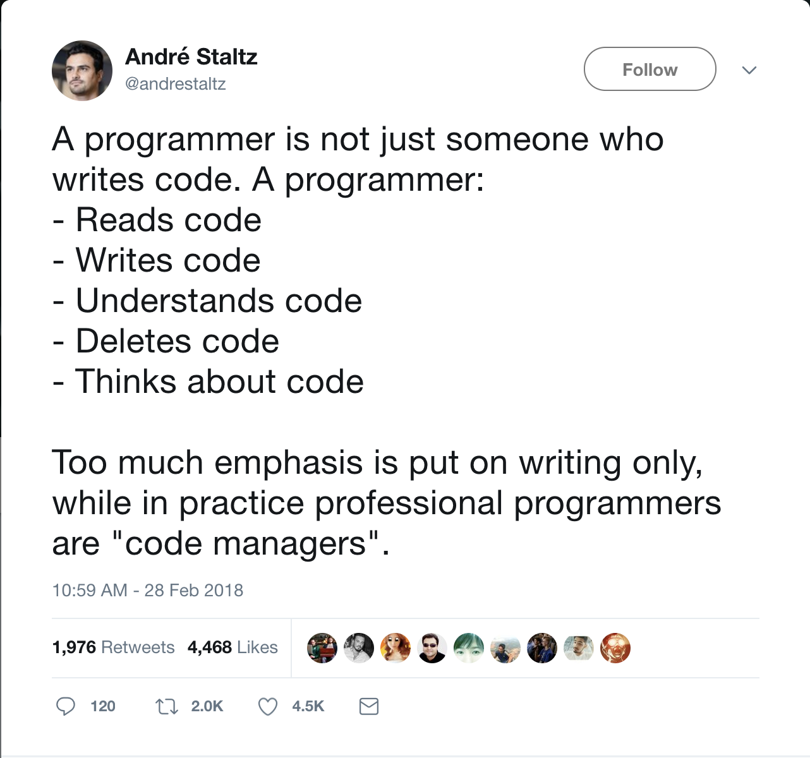

#### Programación funcional con JavaScript y TypeScript en Node.js

---

## ¿Por qué programación funcional?

#### ¿Qué propiedades queremos que tenga nuestro software?{.fragment}

- Corrección{.fragment}
- Flexibilidad{.fragment}

--

--

### Links

[3 levels of software](http://www.pathsensitive.com/2018/01/the-three-levels-of-software-why-code.html)

[Design of software](http://www.pathsensitive.com/2018/01/the-design-of-software-is-thing-apart.html)
